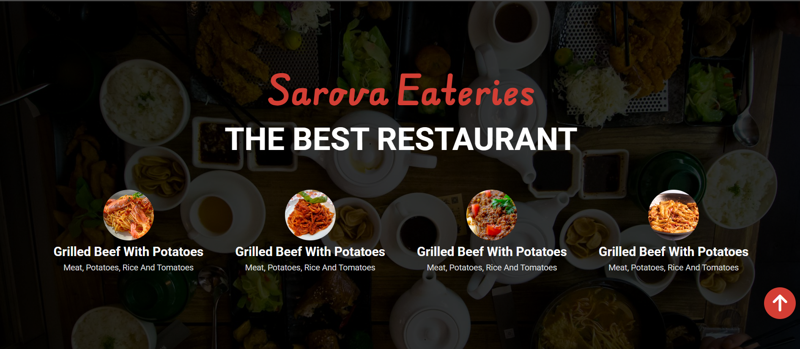

# Sarova Eateries

The following project is a landing page of a fictional resturant website.



## Getting Started

### 1. Clone this Repository

```bash
git clone https://github.com/FrancisMurayaDev/Sarova-Eateries-Landing-Page.git
```

### 2. Navigate to the Repository

```bash
cd Sarova-Eateries-Landing-Page

```

### 3. Install all necessary dependencies

```bash
npm install
```

### 4. Spin up the Local development Server

```bash
npm run dev
```
